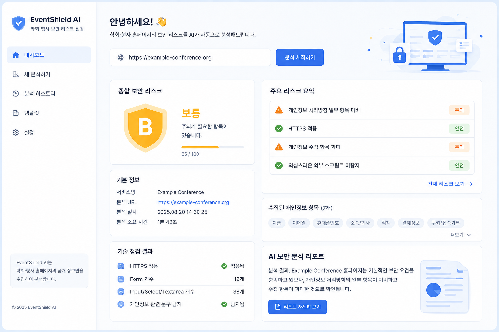

## Preview



# EventShield AI

EventShield AI는 학회·행사 홈페이지의 공개 정보를 수집해 개인정보 수집 항목, 주요 기능, 개인정보 처리방침, 기본 기술 점검 항목을 분석하고 AI 보안 리포트를 생성하는 서비스입니다.

## 1. 프로젝트 소개

학회·행사 웹사이트는 사전등록, 로그인, 결제, QR 입장권, 파일 업로드, 관리자 페이지 등 다양한 기능을 포함하는 경우가 많습니다. 이 과정에서 참가자 이름, 이메일, 연락처, 소속, 국가, 결제 여부 등 개인정보가 수집되지만, 운영자가 보안 리스크를 직접 판단하기는 어렵습니다.

EventShield AI는 사용자가 URL만 입력하면 공개 페이지를 기반으로 정보를 자동 수집하고, AI를 통해 운영자와 개발자가 이해할 수 있는 보안 점검 리포트를 제공합니다.

## 2. 주요 기능

### URL 기반 홈페이지 자동 수집

사용자가 서비스 URL을 입력하면 서버에서 공개 HTML을 수집합니다.

자동 수집 대상은 다음과 같습니다.

* 서비스명
* 개인정보 수집 가능 항목
* 로그인 기능 여부
* 관리자 페이지 관련 키워드
* QR 입장권 관련 키워드
* 결제 기능 관련 키워드
* 파일 업로드 기능 여부
* 개인정보 처리방침 또는 개인정보 수집 동의 문구

### 개인정보 처리방침 자동 탐지

홈페이지에서 개인정보 처리방침 링크를 탐지하고, 해당 페이지의 내용을 가져옵니다.

탐지 방식은 다음과 같습니다.

* `개인정보`, `privacy`, `privacy policy` 등이 포함된 링크 탐지
* `Sign up`, `Register`, `Join`, `사전등록`, `회원가입` 페이지 탐색
* `/privacy`, `/privacy.php`, `/privacy_policy.php`, `/main/signup.php` 등 자주 사용되는 경로 확인
* 본문 내 개인정보 수집·이용 관련 문구 탐지

### 개인정보 처리방침 체크리스트

수집된 개인정보 처리방침 문구를 기반으로 아래 항목을 확인합니다.

* 수집 목적 명시 여부
* 수집 항목 명시 여부
* 보유 및 이용기간 명시 여부
* 제3자 제공 문구 여부
* 위탁 처리 문구 여부
* 문의처 또는 책임자 문구 여부
* 동의 문구 여부

### 기본 기술 점검

홈페이지에서 확인 가능한 기본 기술 정보를 점검합니다.

* HTTPS 적용 여부
* Form 개수
* Input / Select / Textarea 개수
* 개인정보 관련 문구 탐지 여부
* 개인정보 처리방침 링크 탐지 여부

### 탐지 근거 표시

자동 수집 결과가 어떤 근거로 판단되었는지 함께 보여줍니다.

예시는 다음과 같습니다.

* 이메일: `"email"` 키워드 발견
* 휴대폰번호: `"phone"`, `"tel"` 키워드 발견
* 로그인: `"login"`, `"password"` 키워드 발견
* 결제: `"payment"`, `"fee"`, `"등록비"` 키워드 발견
* 파일 업로드: `input[type="file"]` 발견

### AI 보안 리포트 생성

자동 수집된 정보를 기반으로 AI가 보안 리포트를 생성합니다.

리포트에는 다음 정보가 포함됩니다.

* 전체 위험도 점수
* 요약 설명
* 항목별 리스크
* 판단 근거
* 운영자 안내
* 개발자 조치사항
* 우선 조치사항 체크리스트

## 3. 기술 스택

* Frontend: Next.js, React, TypeScript
* Styling: Tailwind CSS
* Backend: Next.js API Route
* HTML Parsing: Cheerio
* AI: OpenAI API
* Deployment: Vercel 또는 로컬 실행

## 4. 프로젝트 실행 방법

### 패키지 설치

```bash
npm install
```

필요 패키지가 없다면 아래 패키지도 설치합니다.

```bash
npm install openai zod cheerio
```

### 환경변수 설정

프로젝트 최상위에 `.env.local` 파일을 생성합니다.

```env
OPENAI_API_KEY=your_openai_api_key
OPENAI_MODEL=gpt-4o-mini
```

API 키는 프론트엔드 코드에 직접 넣지 않고, 반드시 서버 환경변수로 관리해야 합니다.

### 개발 서버 실행

```bash
npm run dev
```

브라우저에서 아래 주소로 접속합니다.

```txt
http://localhost:3000
```

## 5. 폴더 구조

```txt
eventshield-ai/
├─ app/
│  ├─ page.tsx
│  └─ api/
│     ├─ analyze/
│     │  └─ route.ts
│     └─ crawl/
│        └─ route.ts
├─ components/
│  ├─ EventShieldClient.tsx
│  ├─ HeroSection.tsx
│  ├─ SecurityInputForm.tsx
│  ├─ ReportResult.tsx
│  └─ RiskItemCard.tsx
├─ types/
│  └─ report.ts
├─ public/
├─ package.json
├─ next.config.js
└─ README.md
```

## 6. 사용 흐름

1. 사용자가 학회·행사 홈페이지 URL을 입력합니다.
2. `홈페이지에서 자동 수집하기` 버튼을 클릭합니다.
3. 서버에서 공개 HTML을 수집합니다.
4. 개인정보 항목, 기능 키워드, 개인정보 처리방침 문구를 탐지합니다.
5. 기본 기술 점검 결과와 탐지 근거를 화면에 표시합니다.
6. 사용자가 `보안 리스크 분석하기` 버튼을 클릭합니다.
7. AI가 전체 위험도와 항목별 보안 리스크를 분석합니다.
8. 운영자용 안내와 개발자용 조치사항이 포함된 리포트를 확인합니다.

## 7. 주요 API

### `/api/crawl`

홈페이지 URL을 기반으로 공개 페이지를 수집하고 분석합니다.

주요 응답 데이터는 다음과 같습니다.

* `serviceName`
* `serviceUrl`
* `personalDataItems`
* `hasLogin`
* `hasAdminPage`
* `hasQrTicket`
* `hasPayment`
* `hasFileUpload`
* `privacyPolicyUrl`
* `privacyPolicyText`
* `crawlSummary`

`crawlSummary`에는 다음 정보가 포함됩니다.

* `technicalChecks`
* `privacyPolicyChecklist`
* `detectionEvidence`
* `detectedFields`

### `/api/analyze`

자동 수집된 정보를 기반으로 AI 보안 리포트를 생성합니다.

주요 응답 데이터는 다음과 같습니다.

* `totalScore`
* `summary`
* `riskItems`
* `priorityActions`

## 8. 보안 및 개인정보 보호 방향

EventShield AI는 공개 페이지에서 확인 가능한 정보만 수집합니다.

다음과 같은 동작은 수행하지 않습니다.

* 로그인 우회
* 숨겨진 관리자 경로 대량 탐색
* 공격성 스캔
* 취약점 악용
* 비공개 페이지 접근
* 사용자 계정 정보 수집

또한 실제 참가자 명단, 비밀번호, 결제정보, 주민등록번호 등 민감정보 입력을 권장하지 않습니다.

입력된 텍스트에 이메일, 전화번호, 주민등록번호, 카드번호 형태가 포함될 경우 서버에서 마스킹 후 AI 분석에 사용하도록 설계할 수 있습니다.

## 9. URL 수집 제한

보안을 위해 내부망 주소나 로컬 주소는 분석 대상에서 제외합니다.

차단 대상 예시는 다음과 같습니다.

* `localhost`
* `127.0.0.1`
* `192.168.x.x`
* `10.x.x.x`
* `172.16.x.x ~ 172.31.x.x`

EventShield AI는 공개 홈페이지 URL을 대상으로 하는 사전 점검 도구입니다.

## 10. AI 분석 시 주의사항

AI 리포트는 사용자가 입력하거나 자동 수집된 정보만을 기준으로 분석합니다.

따라서 입력에 없는 내용을 단정하지 않도록 설계합니다.

예를 들어 다음과 같은 표현은 피합니다.

* 결제 기능이 있다고 해서 카드번호를 직접 저장한다고 단정
* 관리자 페이지가 있다고 해서 이미 노출되었다고 단정
* 파일 업로드 기능이 있다고 해서 악성 파일이 실제 업로드되었다고 단정
* 외부 제공 문구가 없는데 협력사 공유가 있다고 단정

AI 리포트는 사전 점검을 돕는 보조 도구이며, 실제 서비스 오픈 전에는 개발자 또는 보안 전문가의 추가 검토가 필요합니다.

## 11. 현재 구현 범위

현재 구현된 범위는 다음과 같습니다.

* URL 기반 공개 HTML 수집
* 개인정보 처리방침 링크 탐지
* 회원가입/사전등록 페이지 내 개인정보 문구 탐지
* 개인정보 수집 가능 항목 추정
* 로그인, 관리자, QR, 결제, 파일 업로드 관련 키워드 탐지
* HTTPS 여부 확인
* Form/Input 개수 확인
* 개인정보 처리방침 체크리스트 생성
* 탐지 근거 표시
* AI 보안 리포트 생성

## 12. 향후 개선 방향

향후 다음 기능을 추가할 수 있습니다.

* URL 수집 후 AI 분석까지 한 번에 실행
* 리포트 Markdown 또는 PDF 다운로드
* 리포트 복사 기능
* 분석 히스토리 저장
* 개인정보 처리방침 항목별 점수화
* 수집 필드별 민감도 분류
* Playwright 기반 JavaScript 렌더링 페이지 분석
* robots.txt 및 크롤링 정책 확인
* 사이트맵 기반 공개 페이지 탐색
* 운영자용 체크리스트와 개발자용 체크리스트 분리
* 프로젝트별 보안 리포트 저장 및 비교

## 13. 기대 효과

EventShield AI를 통해 행사 운영자는 보안 전문 지식이 부족해도 주요 위험 요소를 빠르게 파악할 수 있습니다.

개발자는 운영자가 이해한 리스크를 기반으로 구체적인 수정 요청을 받을 수 있습니다.

결과적으로 학회·행사 서비스의 개인정보 보호 수준과 운영 안정성을 높이는 데 기여할 수 있습니다.
